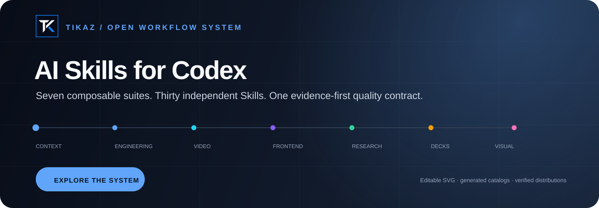

<p align="center">
  
</p>

<h1 align="center">TIKAZ AI Skills for Codex</h1>

<p align="center">
  <strong>面向 Codex 的可组合、可验证工作流集合</strong><br />
  Turn one-off prompts into routed workflows with evidence, quality gates, and portable handoffs.
</p>

<p align="center">
  <a href="https://github.com/TIKAZI/TIKAZ-AI-Skills/actions/workflows/validate.yml"></a>
  <a href="LICENSE"></a>
  
  
</p>

<p align="center">
  <a href="#start-in-60-seconds">Quick start</a> ·
  <a href="#the-six-suite-system">Six suites</a> ·
  <a href="examples/prompts.md">Prompts</a> ·
  <a href="SOURCES.yml">Provenance</a> ·
  <a href="CONTRIBUTING.md">Contributing</a>
</p>

---

## One collection. Six workflows. One quality contract.

TIKAZ AI Skills is a community-maintained monorepo for **Codex and compatible Skill hosts**. Six suites live together because useful work crosses boundaries: video evidence can become research, research can become a deck, and an approved interface can move into engineering delivery.

Each suite remains independently installable. The collection supplies the shared rules that keep handoffs coherent:

```text
USER GOAL
   ↓
ONE PRIMARY SUITE  ──→  specialist Skills only when needed
   ↓
STRUCTURED HANDOFF ──→  evidence · uncertainty · source · license
   ↓
QUALITY GATE       ──→  render · test · review · artifact proof
   ↓
VERIFIED DELIVERY
```

This is not an OpenAI-official repository. It is designed, integrated, refactored, and continuously maintained by **TIKAZ** for real Codex workflows.

## Start with the flagships

| | Suite | What makes it different |
|---|---|---|
| **01** | **[Frontend Design](suites/frontend-design)** | Classifies the product surface, commits to one visual world, and requires a desktop/mobile art-direction proof before full implementation. |
| **02** | **[Video Intelligence](suites/video-intelligence)** | Never treats metadata, transcript, keyframe, and primary-source verification as equivalent evidence. Produces timestamped, auditable synthesis. |

```text
Use frontend-design to redesign this dashboard. Write the Design Read,
set the three project dials, and approve a desktop/mobile proof first.
```

```text
Use video-platform-reader to compare these videos. Keep timestamps,
label evidence levels, and list every claim that remains unverified.
```

## The six-suite system

| Suite | Skills | Owns | Typical path |
|---|---:|---|---|
| **[Video Intelligence](suites/video-intelligence)** | 2 | Auditable video learning | sources → transcript/ASR → keyframes → evidence cards → synthesis |
| **[Frontend Design](suites/frontend-design)** | 2 | Distinctive product interfaces | surface → Design Read → proof → implementation → visual QA |
| **[Engineering](suites/engineering)** | 6 | Safe repository delivery | specification → impact map → code → tests → review → release evidence |
| **[Knowledge & Research](suites/knowledge-research)** | 6 | Traceable decisions | question → sources → evidence ledger → disagreement → recommendation |
| **[Presentation](suites/presentation)** | 4 | Verified decks | narrative → one format → page contracts → render QA → artifact |
| **[Visual Content](suites/visual-content)** | 5 | Publishable content assets | thesis → one style → shot card → creation → publishing QA |

There are **25 installable Skills**, including the six suite orchestrators. Use a suite orchestrator for an end-to-end outcome; install a child Skill when you need only one focused capability.

### Install a complete suite separately

The monorepo is the **single source of truth**. Six focused repositories are automatically generated from it so each suite can be discovered, starred, cloned, and installed on its own without creating seven drifting codebases.

| Standalone distribution | Best entry point |
|---|---|
| [TIKAZ Frontend Design for Codex](https://github.com/TIKAZI/TIKAZ-Codex-Frontend-Design) | Interface art direction, implementation, and visual QA |
| [TIKAZ Video Intelligence for Codex](https://github.com/TIKAZI/TIKAZ-Codex-Video-Intelligence) | Timestamped video evidence and synthesis |
| [TIKAZ Engineering Workflows for Codex](https://github.com/TIKAZI/TIKAZ-Codex-Engineering) | Repository delivery, impact analysis, review, and operations |
| [TIKAZ Knowledge & Research for Codex](https://github.com/TIKAZI/TIKAZ-Codex-Knowledge-Research) | Research, source normalization, decisions, and reusable memory |
| [TIKAZ Presentation Workflows for Codex](https://github.com/TIKAZI/TIKAZ-Codex-Presentation) | HTML, editable PPTX, and editorial web decks |
| [TIKAZ Visual Content for Codex](https://github.com/TIKAZI/TIKAZ-Codex-Visual-Content) | Illustration direction, concise writing, and lawful music |

Each distribution records the exact canonical commit in `DISTRIBUTION.yml`, validates independently, and synchronizes weekly or on demand. Cross-suite development and source-of-truth Issues stay in this repository.

## Start in 60 seconds

### 1. Clone

```bash
git clone https://github.com/TIKAZI/TIKAZ-AI-Skills.git
cd TIKAZ-AI-Skills
```

### 2. Install one Skill

Copy the suite or child folder into the Skill directory supported by your Codex environment. Keep the folder name identical to the `name` in `SKILL.md`.

Project-local example on PowerShell:

```powershell
Copy-Item -Recurse `
  -LiteralPath '.\suites\frontend-design\frontend-design-studio' `
  -Destination '.\.agents\skills\frontend-design-studio'
```

### 3. Invoke it naturally

```text
Use frontend-design-studio to turn this bland landing page into one coherent
visual world. Show the first viewport and one representative section before
expanding the whole page.
```

See [copy-ready prompts](examples/prompts.md) for every suite.

## Why it is more than a prompt collection

- **One owner per deliverable** — supporting Skills cannot compete for control.
- **Evidence travels with work** — claims retain timestamps, confidence, sources, and unresolved gaps.
- **Visual proof before scale** — frontend, presentation, and illustration workflows verify representative output early.
- **Objective completion gates** — builds, tests, rendered artifacts, and file state outrank agent confidence.
- **Portable by design** — no private drive paths, embedded credentials, or universal claims about optional tools.
- **Auditable provenance** — clean-room work, adapters, references, and removed upstream material are distinguished explicitly.

## Repository map

```text
TIKAZ-AI-Skills/
├─ suites/                    # six independently installable workflow suites
│  ├─ frontend-design/        # flagship: art direction + implementation gates
│  ├─ video-intelligence/     # flagship: evidence-based video understanding
│  ├─ engineering/
│  ├─ knowledge-research/
│  ├─ presentation/
│  └─ visual-content/
├─ examples/                  # copy-ready invocation prompts
├─ scripts/                   # repository validation gate
├─ SOURCES.yml                # source mode, license, and TIKAZ contribution
└─ THIRD_PARTY_NOTICES.md     # research acknowledgements and boundaries
```

## Validation

Every push runs the repository policy gate on GitHub Actions.

```powershell
powershell -NoProfile -ExecutionPolicy Bypass `
  -File '.\scripts\validate_skills.ps1'
```

It checks all 25 Skills for structure, attribution, source policy, portability, routing, UI metadata, generated files, and Python syntax. A green check proves repository consistency; optional platform access still depends on the user's environment and permissions.

## Authorship, sources, and license

The collection architecture, TIKAZ Edition workflows, routing contracts, lifecycle gates, templates, portability rules, and validation scripts are designed, integrated, refactored, and continuously maintained by **TIKAZ**.

Research references do not transfer authorship. Their URLs, observed licenses, distribution status, and the concrete TIKAZ contribution are recorded in [SOURCES.yml](SOURCES.yml) and [THIRD_PARTY_NOTICES.md](THIRD_PARTY_NOTICES.md).

TIKAZ-authored files are released under the [MIT License](LICENSE). Contributions should improve behavior, evidence, portability, or verification—not merely rename an existing Skill. See [CONTRIBUTING.md](CONTRIBUTING.md).
