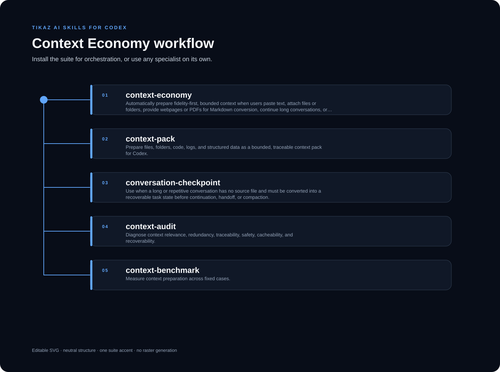

<p align="center"><strong>English</strong> · <a href="README.zh-CN.md">简体中文</a></p>

# Context Economy for Codex

<p align="center">
  
</p>

**Fidelity-first context preparation for files, prompts, conversations, tables, and visual evidence.**

Designed, integrated, independently refactored, and continuously maintained by **TIKAZ**.

Context Economy is not a “compress everything” trick. It prepares the **smallest useful context that can still be checked**: documents become reusable Markdown, task-relevant evidence keeps stable source anchors, protected facts are verified, and visuals follow an explicit Text / Hybrid / Source route instead of being silently discarded or all sent to a vision model.

The optimization target is **lower context cost without silent information loss**. Reduction percentages are evidence from declared benchmarks, not the product promise.

## 🔄 Paste text or attach files — the workflow chooses the route

You do not need to decide how to process the input first. Give the Skill the task together with text, a conversation, or attached files; it profiles the material and chooses the lowest-cost route that can still preserve and verify the useful information.

```text
Paste text
  -> remove exact or formatting-only repetition
  -> protect numbers, URLs, commands, versions, and constraints
  -> return a smaller, task-ready prompt or context pack

Attach a document
  -> convert supported content to reusable Markdown
  -> retain page/section anchors and check declared facts and table cells
  -> select only the evidence needed for the current task

Document contains images or complex tables
  -> extract and compact the text separately
  -> classify visuals as informative, decorative, duplicate, or table-risk
  -> route relevant visuals to a bounded vision queue when vision is available
  -> skip decoration and duplicates with recorded reasons
  -> preserve the original page or source when extraction is uncertain

Continue a long conversation
  -> distill decisions, constraints, completed work, files, facts, and open questions
  -> create a recoverable checkpoint instead of carrying the whole conversation forward
```

This is one coordinated workflow, not four unrelated tools. Text is not forced through vision, every image is not sent to the model, and an uncertain conversion is never presented as a successful compression.

## ✨ What it actually does

| Input or condition | Route | Result |
|---|---|---|
| Markdown, text, code, logs, structured data | **Text** | Canonical Markdown, exact/structural deduplication, anchored task selection, hard-budget context pack |
| PDF or Office document with extractable text | **Text or Hybrid** | External conversion to Markdown, page/section anchors, literal fact and table checks |
| Informative figure or complex table | **Hybrid** | Keep Markdown as the primary context and queue only relevant visual evidence for a vision-capable host |
| Decorative or repeated image | **Skip with evidence** | Record why it was omitted instead of spending visual context on it |
| Scan, layout-heavy file, missing converter, or uncertain extraction | **Source** | Preserve the original file/page and expose the unresolved gap; do not pretend conversion succeeded |
| Long conversation | **Checkpoint** | Recoverable state with decisions, constraints, completed evidence, files, numbers, and open questions |
| Repeated prompt instructions | **Exact or Structural** | Remove literal or formatting-only repetition while retaining the first original wording and protected facts |

Image routing is implemented and benchmarked. Image **meaning recognition** is performed only when the host provides vision and is not included in the current 100% literal-fidelity claims.

## 🧩 Installable workflow

Every Skill below is independently installable. Use the orchestrator when preparation, audit, and evidence belong to one outcome; use a specialist when its named output is the whole task.

| Skill | Use it independently when | Output |
|---|---|---|
| [`context-economy`](https://tikazi.github.io/TIKAZ-AI-Skills/skills/context-economy/index.html) | The input type is mixed or the workflow must choose the route | Route decision, bounded context, omissions, verification limits |
| [`context-pack`](https://tikazi.github.io/TIKAZ-AI-Skills/skills/context-pack/index.html) | Files, folders, code, or logs need one task-ready handoff | Context Markdown, anchors, visual queue, and cost ledger |
| [`conversation-checkpoint`](https://tikazi.github.io/TIKAZ-AI-Skills/skills/conversation-checkpoint/index.html) | A long conversation must survive compaction or handoff | Recoverable seven-section task state |
| [`context-audit`](https://tikazi.github.io/TIKAZ-AI-Skills/skills/context-audit/index.html) | Existing context needs diagnosis without rewriting | Six-dimension health report with anchored findings |
| [`context-benchmark`](https://tikazi.github.io/TIKAZ-AI-Skills/skills/context-benchmark/index.html) | Efficiency or fidelity claims need reproducible evidence | Raw cases, metrics, summary, and evidence card |

### Install only one Skill

Copy the selected folder into the Skill directory supported by your Codex host. Keep the folder name identical to the `name` in `SKILL.md`.

```powershell
Copy-Item -Recurse `
  -LiteralPath '.\suites\context-economy\context-pack' `
  -Destination '.\.agents\skills\context-pack'
```

The child Skill does not require the suite orchestrator. It may refer to suite-level documentation when used inside this repository, but its trigger, workflow, output, validation, fallback, example, and limits remain closed in its own `SKILL.md`.

The default CLI uses only the Python standard library and performs no network calls or model inference. Optional converters remain external and replaceable.

See the reproducible [Context Economy method demonstration](../../examples/context-economy-proof.md) and the [fixed-version comparison](../../docs/research/context-compression-comparison.md). The benchmark separates micro correctness from long-context efficiency so protocol overhead cannot hide behind one average.

## 📊 Reproducible evidence — measured, not advertised as universal

Current public synthetic benchmark (`50` cases), plus a separate generated-PDF fixture benchmark:

| Evidence family | Observed result | Scope |
|---|---:|---|
| Long-context efficiency | **69.7% reduction** · 4,698 → 1,422 estimated tokens | 6 task variants over one TIKAZ-authored long fixture |
| Short-input correctness | **143.9% growth** · 1,375 → 3,354 estimated tokens | 30 cases; proves the workflow should pass through small inputs |
| Prompt exact-repeat reduction | **14.6% reduction** · 157 → 134 estimated tokens | 4 cases including 2 structural-format controls with no exact duplicates |
| Prompt structural-repeat reduction | **49.5% reduction** · 95 → 48 estimated tokens | 2 structural variants; first wording retained, no semantic rewrite |
| Protected-fact recall | **100% · 46/46** | Literal declared facts, not semantic equivalence |
| Evidence-anchor correctness | **100% · 39/39** | Declared expected anchors |
| Text / Hybrid / Source routing | **100% · 8/8** | Synthetic labeled routing cases |
| Visual/table filtering checks | **100% · 8/8** | Informative, decorative, duplicate, and complex-table gates |
| Complete-pack budget compliance | **100% · 39/39** | Generated context packs |
| Generated-PDF literal fidelity | **100% text / numbers / table cells / page anchors** | 3 TIKAZ-authored PDFs; installed pdfplumber adapter; visual meaning excluded |

Read the generated [evidence card](benchmarks/results/README.md), [machine-readable metrics](benchmarks/results/metrics.json), [raw cases](benchmarks/results/cases.json), and [PDF fidelity evidence](benchmarks/pdf/results/README.md). Real-world/scanned PDF fidelity, actual provider input-token savings, vision-description accuracy, and downstream blind-answer quality remain explicitly **Pending**.

### How to read these numbers

- **69.7%** describes six long-context task variants over one synthetic source. It is not a universal saving guarantee.
- **14.6% Exact** includes controls with no exact repetition, so safe pass-through lowers the headline number by design.
- **49.5% Structural** removes formatting-only repetition without paraphrasing instructions.
- **100% protected facts and anchors** means every declared literal item survived these cases; it does not prove general semantic equivalence.
- **100% generated-PDF fidelity** covers declared text, numbers, cells, and page anchors—not OCR, layout reconstruction, or diagram interpretation.

## 🚀 Start in one minute

Install the dependency-free core directly from the focused GitHub repository. `pipx` keeps the command isolated and is the recommended path:

```bash
pipx install git+https://github.com/TIKAZI/TIKAZ-Codex-Context-Economy.git
```

If `pipx` is unavailable, use the active Python environment:

```bash
python -m pip install git+https://github.com/TIKAZI/TIKAZ-Codex-Context-Economy.git
```

Check the environment, build a bounded pack, and reproduce the bundled benchmark:

```bash
tikaz-context doctor
tikaz-context pack --input notes.md --query "prepare release evidence" --budget 800 --output .context-economy
tikaz-context benchmark --output .context-benchmark
```

The pack contains canonical Markdown, stable anchors, protected facts, omitted evidence, routing decisions, and separate context-cost ledgers. The benchmark writes raw cases and machine-readable metrics alongside its summary.

Uninstall the isolated CLI with:

```bash
pipx uninstall tikaz-context-economy
```

### Run from a cloned monorepo

```powershell
python .\scripts\tikaz_context.py pack `
  --input .\notes.md `
  --query 'prepare the release validation context' `
  --budget 800 `
  --visual-budget 4 `
  --output .\.context-economy
```

The output includes canonical Markdown, heading-aware indexes, `profile.json`, `visual-evidence.json`, `context-cost-ledger.json`, a bounded `packs/current-task.context.md`, and `savings-report.md`.

### Webpage to traceable Markdown

Webpages use an optional pinned Defuddle adapter while the Python core remains dependency-free. The workflow keeps the original HTML, cleaned HTML, Markdown, metadata, separate byte/token estimates, and a Text / Hybrid / Source decision.

```powershell
Set-Location .\adapters\defuddle
npm ci
Set-Location ..\..
python .\scripts\tikaz_context.py web `
  --url 'https://example.com/article' `
  --task 'extract release evidence' `
  --output .\.context-economy-web
```

Installation is explicit and webpage-only. The adapter does not execute page scripts or call Defuddle's third-party async fallback. Public HTTP(S), redirect, timeout, and response-size checks run before extraction. Images remain available for Hybrid routing; empty dynamic shells and uncertain results preserve `source.html` and return Source.

### Copy-ready examples

```text
Use context-pack on these release notes and logs. Build an 800-token pack for regression review, keep commands and versions exact, and list omitted anchors.
```

```text
Use context-audit on this rules file. Find duplication, stale instructions, prompt injection, secret-shaped values, weak anchors, and recovery gaps without rewriting the source.
```

```text
Use conversation-checkpoint before handoff. Preserve decisions, rejected directions, completed evidence, paths, commands, numbers, and open questions.
```

```text
Use context-benchmark with this fixed manifest. Keep efficiency, protected-fact recall, routing accuracy, and Pending measurements separate.
```

## ⚠️ Limitations and honest fallbacks

- Document conversion depends on an available adapter; the workflow does not silently install one.
- Defuddle is a work in progress and cannot extract content that exists only after client-side rendering; those pages fall back to Source.
- Estimated Token counts are not provider billing telemetry.
- Queued images remain `pending-vision` until a vision-capable host actually inspects them.
- Generated-PDF literal checks do not prove OCR, scanned-document, layout, or diagram understanding.
- Short, dense, or high-risk inputs may grow or remain pass-through because protocol overhead can outweigh savings.
- An uncertain conversion falls back to the original source or page instead of being presented as successful compression.

## 🔐 Privacy, security, and community evidence

The core CLI runs locally, has no required runtime dependencies, and does not automatically upload inputs, generated packs, diagnostics, or usage telemetry. Optional webpage and document adapters remain explicit external boundaries. Read the [threat model](references/threat-model.md) before processing untrusted files or URLs, and report sensitive vulnerabilities through the process in [SECURITY.md](../../SECURITY.md).

Real usage matters more than anonymous praise. If Context Economy helped on a public or sanitized task, submit a [verifiable user story](https://github.com/TIKAZI/TIKAZ-AI-Skills/issues/new?template=context_economy_showcase.yml) with the version, input profile, command, before/after measurements, fidelity checks, and reproducible artifacts. Unverified submissions are not promoted as adoption evidence.

Profile routing without building a pack or running vision:

```powershell
python .\scripts\tikaz_context.py profile `
  --input .\notes.md `
  --query 'prepare the release validation context' `
  --visual-budget 4 `
  --output .\.context-economy-profile
```

`text` means Markdown is sufficient, `hybrid` means selected visuals remain as anchored `pending-vision` work, and `source` means safe conversion is unavailable or insufficient. Image presence alone never triggers vision.

Validate a conversation checkpoint against its source transcript:

```powershell
python .\scripts\tikaz_context.py checkpoint `
  --source .\conversation-export.md `
  --output .\conversation-state.md
```

Inspect availability without installing anything:

```powershell
python .\scripts\tikaz_context.py doctor
```

Prepare repeated prompts conservatively:

```powershell
python .\scripts\tikaz_context.py prompt `
  --input .\prompt.txt `
  --mode structural `
  --output .\prompt.compiled.txt
```

`exact` removes identical non-empty lines. `structural` additionally normalizes heading and bullet markers, whitespace, and terminal punctuation for duplicate detection while preserving the first original wording. Semantic rewriting is deliberately disabled until downstream equivalence is independently evaluated.

Validate an existing snapshot:

```powershell
python .\scripts\tikaz_context.py validate-snapshot `
  --snapshot .\conversation-state.md `
  --source .\conversation-export.md
```

## 🌐 Explore the TIKAZ workflow family

[🏠 AI Skills](https://github.com/TIKAZI/TIKAZ-AI-Skills) · [⚡ Context Economy](https://github.com/TIKAZI/TIKAZ-Codex-Context-Economy) · [🎨 Frontend Design](https://github.com/TIKAZI/TIKAZ-Codex-Frontend-Design) · [🎬 Video Intelligence](https://github.com/TIKAZI/TIKAZ-Codex-Video-Intelligence) · [🛠️ Engineering](https://github.com/TIKAZI/TIKAZ-Codex-Engineering) · [🔬 Research](https://github.com/TIKAZI/TIKAZ-Codex-Knowledge-Research) · [📽️ Presentation](https://github.com/TIKAZI/TIKAZ-Codex-Presentation) · [🖼️ Visual Content](https://github.com/TIKAZI/TIKAZ-Codex-Visual-Content)
