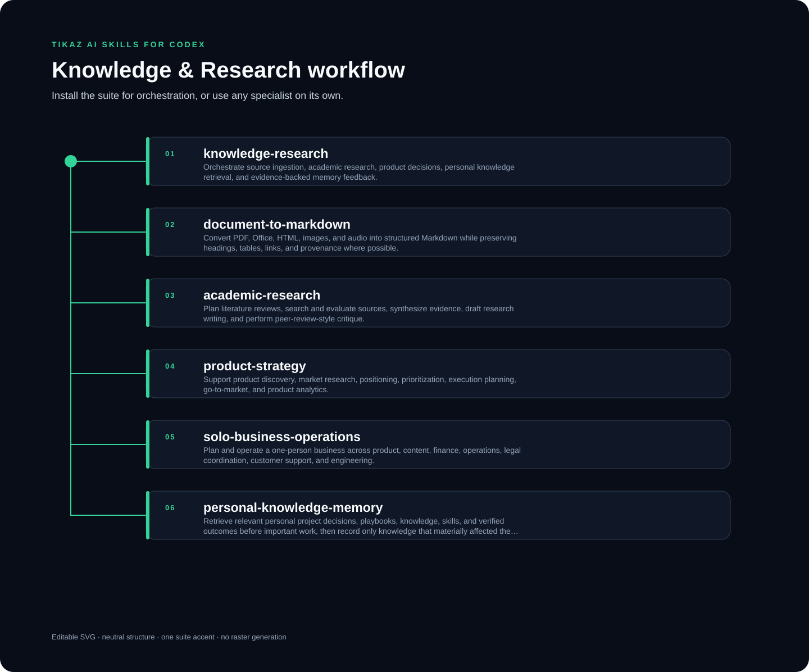

<p align="center"><a href="README.md">English</a> · <strong>简体中文</strong></p>

<p align="center"></p>

# TIKAZ Knowledge & Research for Codex

**保留证据台账、分歧、置信度和知识反馈的可追溯研究与决策流程。**

由 **TIKAZ** 主导设计、整合、独立重构和持续维护。

## 🧩 可以单独使用的 Skill

| Skill | 用途 |
|---|---|
| [`knowledge-research`](https://tikazi.github.io/TIKAZ-AI-Skills/zh/skills/knowledge-research/index.html) | 来源摄取、研究、决策和知识反馈的完整编排 |
| [`document-to-markdown`](https://tikazi.github.io/TIKAZ-AI-Skills/zh/skills/document-to-markdown/index.html) | PDF、Office、HTML、图片与音频的结构化 Markdown 转换 |
| [`academic-research`](https://tikazi.github.io/TIKAZ-AI-Skills/zh/skills/academic-research/index.html) | 文献检索、证据综合、论文写作和同行评审式检查 |
| [`product-strategy`](https://tikazi.github.io/TIKAZ-AI-Skills/zh/skills/product-strategy/index.html) | 产品发现、定位、优先级、GTM 和验证实验 |
| [`solo-business-operations`](https://tikazi.github.io/TIKAZ-AI-Skills/zh/skills/solo-business-operations/index.html) | 一人业务的容量、成本、风险、指标和运营节奏 |
| [`personal-knowledge-memory`](https://tikazi.github.io/TIKAZ-AI-Skills/zh/skills/personal-knowledge-memory/index.html) | 检索个人决策并只记录真正影响任务的知识 |

## 🚀 示例

```text
使用 knowledge-research 整理这些来源，比较支持与反对证据，并给出带置信度和复核清单的建议。
```

## ⚠️ 限制

- 文档转换不等于内容已经核实，检索结果也不等于已采用知识。
- 来源日期、分歧、置信度和未来复核需求必须保留。
- 法律、财务、医疗或安全关键结论仍可能需要专业人士审查。

来源与贡献边界见 [SOURCES.yml](../../SOURCES.yml) 与 [THIRD_PARTY_NOTICES.md](../../THIRD_PARTY_NOTICES.md)。

## 🌐 探索 TIKAZ 工作流家族

[🏠 AI Skills](https://github.com/TIKAZI/TIKAZ-AI-Skills) · [⚡ Context Economy](https://github.com/TIKAZI/TIKAZ-Codex-Context-Economy) · [🎨 Frontend Design](https://github.com/TIKAZI/TIKAZ-Codex-Frontend-Design) · [🎬 Video Intelligence](https://github.com/TIKAZI/TIKAZ-Codex-Video-Intelligence) · [🛠️ Engineering](https://github.com/TIKAZI/TIKAZ-Codex-Engineering) · [🔬 Research](https://github.com/TIKAZI/TIKAZ-Codex-Knowledge-Research) · [📽️ Presentation](https://github.com/TIKAZI/TIKAZ-Codex-Presentation) · [🖼️ Visual Content](https://github.com/TIKAZI/TIKAZ-Codex-Visual-Content)
