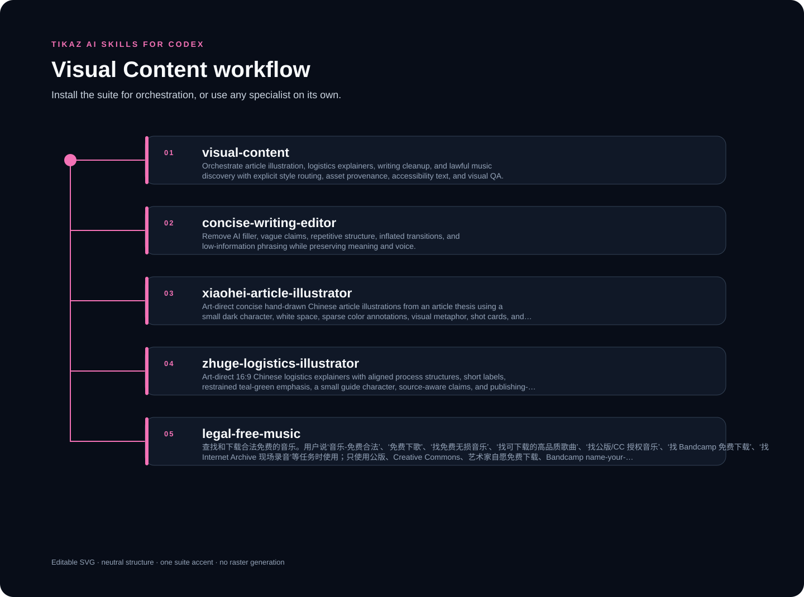

<p align="center"><strong>English</strong> · <a href="README.zh-CN.md">简体中文</a></p>

<p align="center"></p>

# TIKAZ Visual Content for Codex

**Provider-neutral illustration, concise writing, and lawful music workflows with publishing QA.**

Designed, integrated, independently refactored, and continuously maintained by **TIKAZ**.

This suite can be installed as one routed workflow, while every child Skill can also be installed and invoked on its own. It is an independent community project for Codex-compatible Skill hosts, not an OpenAI-official repository.

## ✨ What makes it different

- One visual identity and one shot card own each asset.
- Chinese labels, factual claims, alt text, and publishing-size legibility are verified.
- Music discovery retains license and attribution evidence.

## 🧩 Skills you can use independently

| Skill | Role | Core promise |
|---|---|---|
| [`visual-content`](https://tikazi.github.io/TIKAZ-AI-Skills/skills/visual-content/index.html) | Orchestrator | Orchestrate article illustration, logistics explainers, writing cleanup, and lawful music discovery with explicit style routing, asset provenance, accessibility text, an… |
| [`concise-writing-editor`](https://tikazi.github.io/TIKAZ-AI-Skills/skills/concise-writing-editor/index.html) | Specialist | Remove AI filler, vague claims, repetitive structure, inflated transitions, and low-information phrasing while preserving meaning and voice. |
| [`xiaohei-article-illustrator`](https://tikazi.github.io/TIKAZ-AI-Skills/skills/xiaohei-article-illustrator/index.html) | Specialist | Art-direct concise hand-drawn Chinese article illustrations from an article thesis using a small dark character, white space, sparse color annotations, visual metaphor,… |
| [`zhuge-logistics-illustrator`](https://tikazi.github.io/TIKAZ-AI-Skills/skills/zhuge-logistics-illustrator/index.html) | Specialist | Art-direct 16:9 Chinese logistics explainers with aligned process structures, short labels, restrained teal-green emphasis, a small guide character, source-aware claims,… |
| [`legal-free-music`](https://tikazi.github.io/TIKAZ-AI-Skills/skills/legal-free-music/index.html) | Specialist | 查找和下载合法免费的音乐。用户说‘音乐-免费合法’、‘免费下歌’、‘找免费无损音乐’、‘找可下载的高品质歌曲’、‘找公版/CC 授权音乐’、‘找 Bandcamp 免费下载’、‘找 Internet Archive 现场录音’等任务时使用；只使用公版、Creative Commons、艺术家自愿免费下载、Bandcamp name-yo… |

The root orchestrator owns end-to-end routing. A specialist owns only the output named in its `SKILL.md`; it does not need the orchestrator to be installed.

## 🚀 Try it

```text
Turn this essay into one original hand-drawn metaphor with a shot card, verified Chinese labels, and alt text.
```

```text
Explain this warehouse process as a sourced 16:9 logistics diagram with aligned nodes and explicit exceptions.
```

```text
Remove filler from this caption, then find lawful music and retain the download and attribution evidence.
```

## 📦 Install the suite or one Skill

Copy this suite folder for the complete workflow, or copy one child folder into the Skill directory supported by your Codex host. Keep the destination folder identical to the `name` in `SKILL.md`.

```powershell
Copy-Item -Recurse `
  -LiteralPath '.\suites\visual-content' `
  -Destination '.\.agents\skills\visual-content'
```

## 🔄 Workflow and output contract

Read [routing](references/routing.md) for owner selection and [output contract](references/output-contract.md) for the verified handoff. The diagram above is editable SVG generated from canonical Skill metadata under the shared [TIKAZ visual system](../../docs/visual-system.md).

## ⚠️ Limitations

- The suite does not require or promise a specific image provider.
- Unverified labels or business claims are not turned into definitive visuals.
- Music is downloaded only from sources that explicitly permit it, with license evidence retained.

## ⚖️ Provenance

Source modes, upstream licenses, and concrete TIKAZ contributions are recorded in [SOURCES.yml](../../SOURCES.yml) and [THIRD_PARTY_NOTICES.md](../../THIRD_PARTY_NOTICES.md). TIKAZ authorship applies to original architecture, integration, refactoring, routing, and maintenance; it does not erase third-party ownership.

## 🌐 Explore the TIKAZ workflow family

[🏠 AI Skills](https://github.com/TIKAZI/TIKAZ-AI-Skills) · [⚡ Context Economy](https://github.com/TIKAZI/TIKAZ-Codex-Context-Economy) · [🎨 Frontend Design](https://github.com/TIKAZI/TIKAZ-Codex-Frontend-Design) · [🎬 Video Intelligence](https://github.com/TIKAZI/TIKAZ-Codex-Video-Intelligence) · [🛠️ Engineering](https://github.com/TIKAZI/TIKAZ-Codex-Engineering) · [🔬 Research](https://github.com/TIKAZI/TIKAZ-Codex-Knowledge-Research) · [📽️ Presentation](https://github.com/TIKAZI/TIKAZ-Codex-Presentation) · [🖼️ Visual Content](https://github.com/TIKAZI/TIKAZ-Codex-Visual-Content)
